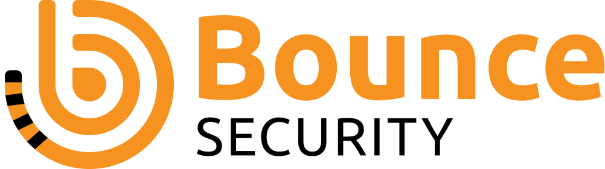

# AGHAST Supporters

## Introduction

The AGHAST project gratefully recognizes organizations that support its development through monetary donations or by enabling contributors to spend significant time working on the project as part of their employment. We recognize various tiers of support, and the duration of recognition depends on the level of support.

Supporters are listed here and on the project website, with a link to their website. If your organization would like to become a Primary, Secondary, or Tertiary supporter, you can make a [donation to OWASP](https://owasp.org/donate/) of $1,000 or more and choose to restrict your gift to AGHAST.

Alternatively, when paying your corporate membership, you can [allocate part of your membership fee to AGHAST](https://owasp.org/supporters/benefits#corporate-sponsorship-of-participating-projects-or-chapters). The amount allocated determines the supporter tier.

## Maintaining Supporters

Organizations that enable contributors to spend significant time maintaining and developing AGHAST as part of their work.

This status is evaluated at the sole discretion of the project leaders. Supporters are listed for two years after the end of their time provision.

## Primary Supporters

Organizations that have donated $7,000 or more to AGHAST through OWASP. Supporters are listed in this section for three years from the donation date.

## Secondary Supporters

Organizations that have donated $3,000 or more to AGHAST through OWASP. Supporters are listed in this section for two years from the donation date.

## Tertiary Supporters

Organizations that have donated $500 or more to AGHAST through OWASP. Supporters are listed in this section for one year from the donation date.

## Associate Supporters

Organizations that have donated another amount to AGHAST through OWASP. Supporters are listed in this section for one year from the donation date.
