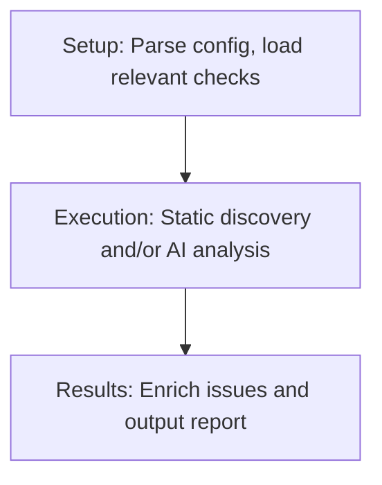
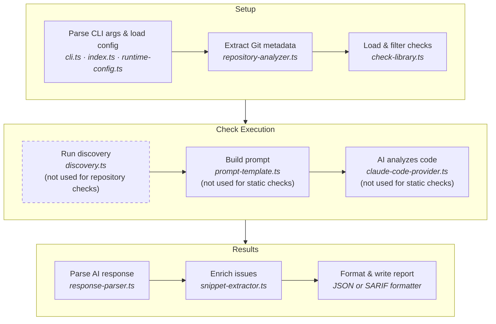
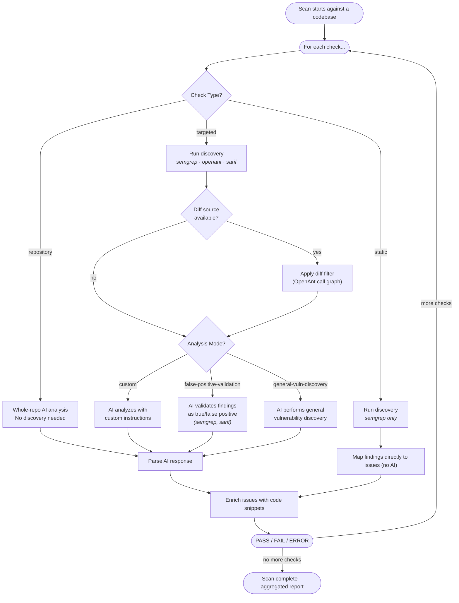
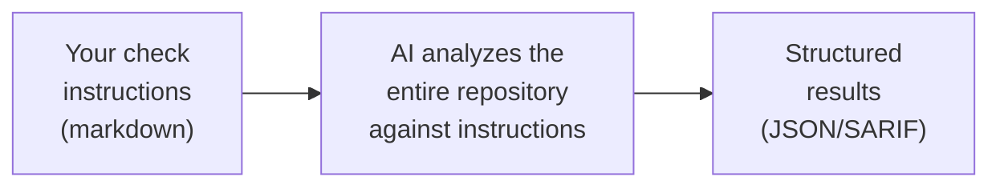
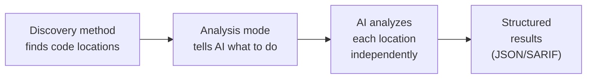
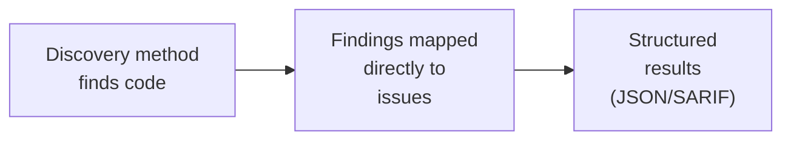

  <strong>AGHAST Documentation</strong> 
  <a href="README.md">&uarr; Documentation Index</a>&nbsp;&nbsp;&bull;&nbsp;&nbsp;<a href="getting-started.md">Getting Started &rarr;</a>

---

# How It Works

Before diving into installation and commands, this page walks through what AGHAST actually does when it runs a scan. No flags or config syntax here, just the concepts.

## The Core Idea

AGHAST runs **checks** against a codebase. Checks generally ask a specific security question such as:

* Are all API endpoints using a recognised authorization mechanism?
* Are we applying all our business logic rules before allowing a user to make a large payment?
* Are the correct decorators being used in the correct situations?

A check is not a generic vulnerability scan. It encodes *your* knowledge of what correct behavior looks like for *your* codebase or organization.

## The Big Picture

A typical AGHAST scan runs multiple checks. There are a few check types (see below). Each check runs sequentially and produces its own pass/fail/error status. The results are aggregated into a single output file containing per-check status (PASS, FAIL, ERROR) and detailed issue information including file paths, line numbers, descriptions, and code snippets.

1. **Setup** - AGHAST parses CLI arguments and runtime configuration, extracts Git metadata from the target repository, and loads the checks that apply to it.
2. **Check Execution** - Each check runs in sequence. Depending on the check type, this may involve running a discovery method to find code locations, building a prompt, and sending it to the AI for analysis  - or mapping findings directly without AI.
3. **Results** - Issues from each check are enriched with code snippets and metadata, then aggregated into a single report (JSON or SARIF).

### Detailed stages

For those interested in the internals, here is how the stages map to modules in the codebase.

Scan process flow (internals)

Not all steps apply to every check type. Discovery is skipped for repository checks, and prompt building / AI analysis are skipped for static checks.

## Three Check Types

AGHAST supports three types of check, each with a different execution flow. Which one you choose depends on how much of the codebase the AI needs to see, and whether you need AI at all.

The following diagram shows the overall process or you can skip over and look at the explanations of the key check types.

Check execution flowchart

A scan runs against a single codebase and may include many checks, each following its own path through this flow.

### Repository checks

A **repository check** hands the entire codebase to the AI along with your instructions and asks it to investigate.

#### When to use

When the question is either:

* Very broad and the AI agent can therefore not be directed to a specific location.
* Very specific to one location in code and therefore that location can be specified directly in the check.

In other cases, this check type is likely to be expensive and unable to comprehensively scan a large codebase.

#### What happens

1. AGHAST loads your check definition and reads the instructions markdown file
2. The instructions are combined with a generic prompt template that tells the AI how to format its response
3. The full prompt is sent to the AI along with access to the repository
4. The AI explores the codebase, evaluates it against your instructions, and returns structured JSON listing any issues it found
5. AGHAST enriches each issue with code snippets extracted from the source files
6. Results are written to the output file

This is the simplest check type: you only need a JSON definition and a markdown file describing what to look for. No static rules required.

### Targeted checks

A **targeted check** combines two things: a **discovery method** that identifies specific locations in the code, and an **analysis mode** that tells the AI what to do with each location.

#### When to use

When you can narrow down where to look before involving the AI. This is the sweet spot for most use cases because the discovery method acts as a filter, so the AI only examines relevant code rather than the entire repo.

#### What happens

1. AGHAST loads the check definition, which specifies a discovery method and an analysis mode
2. The discovery method runs against the codebase and produces a list of **targets**, specific file locations to examine
3. If no targets are found, the check passes immediately (there is nothing to analyze)
4. For each target, AGHAST builds a prompt based on the analysis mode and context about that specific code location
5. The AI analyzes each target independently (multiple targets can be analyzed in parallel)
6. Results from all targets are aggregated, enriched with code snippets, and written to the output file

#### Discovery methods: where to look

Discovery methods are deterministic: they use static analysis or pre-existing results to identify code locations, without involving the AI. The discovery method determines how AGHAST finds the code locations to examine:

- **Semgrep**: write a Semgrep rule that matches code patterns you care about. For example, a rule that finds all functions calling `send_ai_query()`, so the AI can check whether each one performs the required validations first.
- **OpenAnt**: runs [OpenAnt](https://github.com/knostic/OpenAnt/) to extract individual code units (functions, classes) with call graph context (who calls this function, what does it call).
- **SARIF**: reads findings from an external SARIF file (e.g., output from another SAST scanner) and feeds each finding to the AI.

#### Diff filtering: narrowing a discovery to changed code

Discovery methods return all findings across the repo. In PR/CI pipelines you often only care about findings related to what a change actually touched. Provide a diff source at scan time and aghast automatically filters discovery output to the diff's scope — no per-check configuration needed.

1. The discovery (Semgrep, SARIF, or any future SARIF-producing discovery) runs as usual and produces a list of candidate findings.
2. OpenAnt is run to build a call graph of the repo's code units (functions, methods, classes).
3. A code unit counts as "touched" if its line range overlaps a changed region in the diff, *or* if it is a direct caller or callee of a directly-touched unit (a single call-graph hop in each direction).
4. Findings outside touched units are filtered out. For files OpenAnt can't parse (config files, templates), a finding is kept if the file itself appears in the diff.
5. The surviving findings flow into AI analysis exactly as they would without the filter.

**"Touched" is unit-granular, not line-granular.** If you change a single line inside `foo()` (spanning, say, lines 10-50), the entire `foo()` function is touched — so a Semgrep finding elsewhere in `foo()`, at line 30, is kept even though line 30 itself isn't in the diff. This is deliberate: a localised change can affect behaviour anywhere in the same function, and findings in that function are worth reviewing. Three classes of finding survive depth-1 filtering:

1. **Directly-changed code** — findings at lines that appear in the diff.
2. **Same-function findings** — findings anywhere in a function that had *any* change in it.
3. **Caller/callee findings** — findings in functions one call-graph hop away from a changed function.

**Why only one call-graph hop?** It might seem natural to follow the full call stack — "if I changed `validate()`, shouldn't I also check `authenticate()` and `login_flow()` and `handle_request()`?" In practice, transitive closure defeats the purpose of filtering: in a typical repo, chasing every caller of a caller pulls in most of the codebase within two or three hops, so "diff-filtered" becomes indistinguishable from a full scan. Call-graph depth is also a crude proxy for what you actually want (does the change introduce or expose a vulnerable dataflow?) — that's a taint-propagation question, not a call-depth one. Depth 1 captures the immediate blast radius where the AI is likeliest to find something actionable: direct callers ("did I break a contract?") and direct callees ("did I start using something in a new way?"). If you need broader coverage, run the scan without a diff source — the filter is skipped and every finding reaches the AI.

**Automatic.** The filter runs whenever a diff source is available (CLI `--diff-ref`/`--diff-file`, `AGHAST_DIFF_REF`, runtime config, or a check-level `diffRef`) — no `diffFilter: true` flag needed. No diff source? No filter, no error — the scan runs full-repo. To exempt one check from filtering even when a source is provided, set `checkTarget.diffFilter: false` on it.

**Depth-0 fallback when OpenAnt is unavailable.** OpenAnt is only strictly required for `openant` discovery (it provides the targets). For diff filtering on `semgrep` / `sarif` discoveries, OpenAnt is optional: if the binary isn't installed and no `AGHAST_OPENANT_DATASET` is supplied, the filter gracefully falls back to **depth-0 mode** — keep only findings whose file and line range overlap a diff hunk. This means depth-0 **loses both the same-function coverage and the caller/callee hop** (cases 2 and 3 above): changing one line in `foo()` only surfaces that line's own finding, not any other finding elsewhere in `foo()`. aghast logs a clear warning at scan start so the mode switch is visible. Install OpenAnt (or set `AGHAST_OPENANT_DATASET`) to get depth-1 filtering.

Works with **any** discovery whose output has file/line locations — `semgrep`, `sarif`, and `openant` today, and extends naturally to new scanners added in the future. When both the discovery and the filter would otherwise run OpenAnt (e.g. an openant check with `--diff-ref`), the scan runner runs it once and shares the dataset — no double cost.

If the check sets `checkTarget.openant` (a metadata filter over OpenAnt units), the same filter narrows the universe of units the diff-scope computation considers — keeping the discovery's target set and the filter's scope set consistent.

#### Analysis modes: what the AI does

The analysis mode determines what the AI does with each discovered target:

- **Custom** (default): you write your own instructions in a markdown file, tailored to the specific question you want answered. This is the most flexible option.
- **False-positive validation**: the AI evaluates each target as a potential false positive and filters out findings that are not actually vulnerable. Works with Semgrep and SARIF discovery (and with those paired with diff filtering).
- **General vulnerability discovery**: the AI scans each target for a broad range of security vulnerabilities. Works with all discovery methods.

Any discovery method can be paired with any compatible analysis mode. For example, you could use Semgrep discovery with `false-positive-validation` to validate Semgrep findings, or with `custom` instructions to perform deeper analysis on each match.

### Static checks

A **static check** uses a discovery method to find issues directly, with no AI involved at all.

#### When to use

When a static rule alone can definitively answer the question. For example, "does every Flask route have the `@require_api_token` decorator?" . A Semgrep rule can detect missing decorators without any AI interpretation needed.

#### What happens

1. AGHAST loads the check definition, which specifies a discovery method (no instructions file needed)
2. The discovery method runs and produces findings
3. If no findings are found, the check passes
4. Each finding is mapped directly to a security issue. The description comes from the discovery method's output (e.g., the Semgrep rule's `message` field)
5. Issues are enriched with code snippets and written to the output file

This check type doesn't require an agent provider API key, making it fast and free to run.

---

  <strong>AGHAST Documentation</strong> 
  <a href="README.md">&uarr; Documentation Index</a>&nbsp;&nbsp;&bull;&nbsp;&nbsp;<a href="getting-started.md">Getting Started &rarr;</a>

